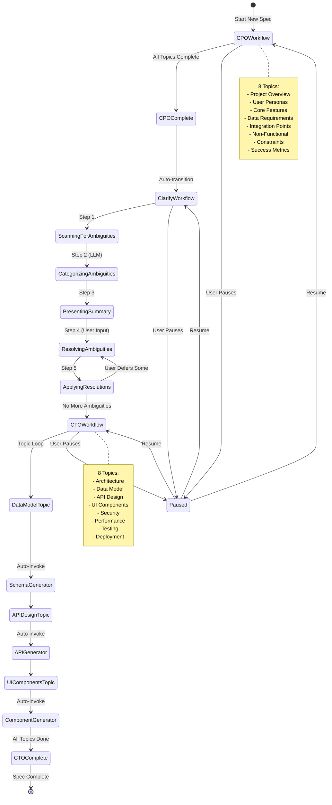
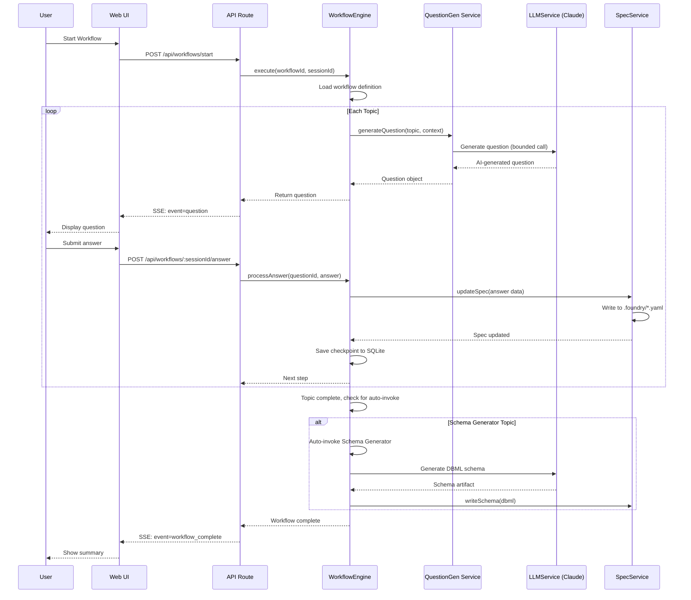

# AI Q&A Flow Specification

**Status:** Draft
**Last Updated:** 2025-11-26

## Overview

The AI Q&A flow is the core interaction model for building specifications. This document details question types, navigation, phase transitions, and workflow state management.

**Architecture:** Q&A is implemented as **workflows** (deterministic step sequences) rather than autonomous agents. This provides:

- Predictable question progression through predefined topics
- AI-generated questions within topic constraints
- Clear progress tracking ("Question 8 of ~20")
- Reliable pause/resume via workflow state checkpoints

**Technical Reference:** For Claude SDK streaming patterns and event specifications, see [research/claude-agent-sdk-apis.md](research/claude-agent-sdk-apis.md)

---

## Question Types

### Supported Input Types

| Type            | Use Case                  | Example                          |
| --------------- | ------------------------- | -------------------------------- |
| Single Choice   | One option from list      | "What database will you use?"    |
| Multiple Choice | Several options from list | "Which user roles exist?"        |
| Text Input      | Names, descriptions       | "What is the feature name?"      |
| Number Input    | Quantities, limits        | "Maximum file upload size (MB)?" |
| Date Input      | Deadlines, schedules      | "Target launch date?"            |

### Question Structure

```typescript
interface AIQuestion {
  id: string;
  type: 'single_choice' | 'multiple_choice' | 'text' | 'number' | 'date';
  question: string;
  description?: string; // Additional context
  options?: QuestionOption[]; // For choice questions
  validation?: ValidationRule; // For input questions
  required: boolean;
  defaultValue?: any;
  context?: string; // Why AI is asking this
}

interface QuestionOption {
  id: string;
  label: string;
  description?: string;
  icon?: string; // Optional visual indicator
}

interface ValidationRule {
  min?: number;
  max?: number;
  pattern?: string; // Regex for text
  message: string; // Error message
}
```

## Navigation

### Full Navigation Model

Users can:

1. **Skip questions** - AI adapts, may ask later
2. **Go back** - Revisit and change previous answers
3. **Edit previous answers** - Triggers re-evaluation

### Edit Previous Answer

When user clicks [Edit] on a previous answer:

1. Show the original question with current answer pre-filled
2. User modifies answer
3. Save new answer
4. **Trigger re-evaluation** - AI reviews change and may:
   - Ask follow-up questions
   - Update dependent artifacts
   - Continue from current position

### Skip Behavior

When user clicks [Skip]:

1. Mark question as skipped
2. AI notes the skip and may:
   - Ask the question again later with more context
   - Make a reasonable default assumption
   - Mark related artifacts as "[TBD]"

---

## Phase Flow

### Three-Phase Workflow Model

**CPO → Clarify (Automatic) → CTO**

Key Difference from Agent Model:

- Topics are predefined (workflow controls sequence)
- Question content is AI-generated within topic constraints (bounded LLM call)
- Generator workflows auto-invoke after relevant CTO topics

### Workflow State Transitions



### Phase Transitions

#### CPO → Clarify (Automatic)

**Trigger:** CPO workflow completes all topic loops.

**Flow:**

1. CPO workflow shows summary
2. Highlights any gaps or [TBD] items
3. **Transitions to Clarify workflow automatically**
4. Clarify scans for ambiguities
5. If ambiguities found → User resolves via question steps
6. If no ambiguities → Proceed to CTO workflow

#### Clarify Workflow (Automatic)

**Trigger:** Automatically invoked when CPO completes

**Clarify Workflow Steps:**

1. **Scan** - Rule-based detection of vague words and missing fields
2. **Categorize** - LLM assigns severity and generates clarifying questions
3. **Present** - Display ambiguity summary to user
4. **Resolve Loop** - User answers or defers each ambiguity
5. **Apply** - Update spec with resolutions

#### CTO → Generators (Automatic)

After relevant CTO topics complete:

- Data Model topic → Schema Generator Workflow
- API Design topic → API Generator Workflow
- UI Components topic → Component Generator Workflow

---

## Question Generation and Answer Loop

### Question → Answer → Generate Sequence



## State Management

### Workflow State Structure

```typescript
interface WorkflowState {
  sessionId: string;
  workflowId: string;
  status: 'in_progress' | 'paused' | 'complete' | 'failed';
  currentStepId: string;
  totalSteps: number;
  currentQuestion?: AIQuestion;
  answers: Record<string, Answer>;
  artifacts: Record<string, any>;
  checkpoints: WorkflowCheckpoint[];
}

interface Answer {
  questionId: string;
  value: any;
  type: 'single_choice' | 'multiple_choice' | 'text' | 'number' | 'date';
  submittedAt: string;
}

interface WorkflowCheckpoint {
  stepId: string;
  state: WorkflowState;
  timestamp: string;
}
```

### State Persistence

**Checkpoint Timing:**

- After each step completes
- Persisted to SQLite via `workflow_checkpoints` table
- On pause: Current state saved at paused step
- On resume: State restored from checkpoint, ready to continue

**Recovery on Browser Close:**

- All session state saved to SQLite
- On reopen: User can resume from exact checkpoint
- Step-level granularity allows retry of individual steps

### Checkpoint and Resume Mechanism

```
┌─────────────────────────────────────────────────────────────────┐
│                    Workflow Execution Flow                      │
└─────────────────────────────────────────────────────────────────┘

Step 1: Project Overview    ┌──────────┐
  [Question Generated]      │ Complete │──┐ Checkpoint saved
  [Answer Received]         └──────────┘  │ to SQLite
  [Spec Updated]                          │
                                          ▼
Step 2: User Personas       ┌──────────┐
  [Question Generated]      │ Complete │──┐ Checkpoint saved
  [Answer Received]         └──────────┘  │
  [Spec Updated]                          │
                                          ▼
Step 3: Core Features       ┌──────────┐
  [Question Generated]      │ Complete │──┐ Checkpoint saved
  [Answer Received]         └──────────┘  │
  [Spec Updated]                          │
                            ◄─────────────┘
                            │
                  ┌─────────┴─────────┐
                  │   USER PAUSES     │
                  │  OR CLOSES TAB    │
                  └─────────┬─────────┘
                            │
                            ▼
              ┌─────────────────────────┐
              │  State Saved to SQLite  │
              │  - sessionId            │
              │  - currentStepId: "3"   │
              │  - answers: {...}       │
              │  - artifacts: {...}     │
              └─────────────────────────┘

                    [Time passes...]

              ┌─────────────────────────┐
              │   USER RETURNS & CLICKS │
              │   "Resume Workflow"     │
              └─────────┬───────────────┘
                        │
                        ▼
              ┌─────────────────────────┐
              │ Restore from Checkpoint │
              │  - Load state from DB   │
              │  - Restore context      │
              │  - Continue at Step 4   │
              └─────────┬───────────────┘
                        │
                        ▼
Step 4: Data Requirements   ┌──────────┐
  [Question Generated]      │In Progress│
  [Waiting for Answer]      └──────────┘

┌─────────────────────────────────────────────────────────────────┐
│  Key Features:                                                  │
│  • Checkpoint after EVERY step completion                       │
│  • Full state serialization (answers, artifacts, context)       │
│  • Resume from exact step where user left off                   │
│  • Step-level retry on failure                                  │
│  • No data loss even on unexpected browser close                │
└─────────────────────────────────────────────────────────────────┘
```
