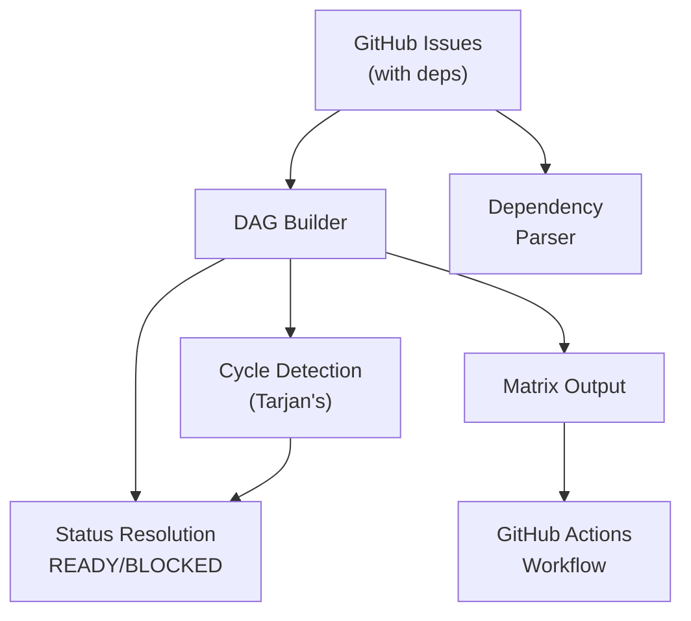

# GitHub Issue DAG Dispatcher

A controller for managing GitHub Issue dependencies and generating execution matrices for distributed workers in GitHub Actions.

## Overview

The dispatch controller is the heart of a distributed, autonomous software factory. It:

1. Fetches GitHub issues with a specified label (default: `queue`)
2. Parses dependency declarations from issue bodies
3. Builds a Directed Acyclic Graph (DAG) of dependencies
4. Determines READY/BLOCKED status for each issue
5. Generates a GitHub Actions matrix for parallel execution

## Architecture



## Installation

The dispatcher is included with Foundry. Run it using:

```bash
# Using bun directly
bun run graph dispatch.config.ts

# Or via npm script
bun run dispatch
```

## Usage

### Command Line Interface

```bash
bun run graph dispatch.config.ts [--verbose] [--help]
```

#### CLI Options

| Option           | Description            |
| ---------------- | ---------------------- |
| `--verbose, -v`  | Enable verbose logging |
| `--help, -h`     | Show help              |

#### Environment Variables

All configuration is via environment variables with `GRAPH_*` prefix:

| Variable                   | Description                     | Default                         |
| -------------------------- | ------------------------------- | ------------------------------- |
| `GITHUB_TOKEN`             | GitHub personal access token    | (required)                      |
| `GITHUB_REPOSITORY`        | Repository in `owner/repo`      | (required)                      |
| `GRAPH_SOURCE`             | Issue source: `label`, `project`| `label`                         |
| `GRAPH_LABEL`              | Label to filter issues          | `queue`                         |
| `GRAPH_PROJECT_OWNER`      | Project owner (for project src) | From `GITHUB_REPOSITORY`        |
| `GRAPH_PROJECT_NUMBER`     | Project number (for project src)| (required if source=project)    |
| `GRAPH_READY_STATUS`       | Status to filter ready issues   | `Ready`                         |
| `GRAPH_IN_PROGRESS_STATUS` | Status when processing          | `In Progress`                   |
| `GRAPH_MAX_CONCURRENT`     | Maximum concurrent issues       | unlimited                       |
| `GRAPH_OUTPUT_FILE`        | Output file for matrix JSON     | stdout                          |
| `GRAPH_DRY_RUN`            | Run without side effects        | `false`                         |
| `GRAPH_VERBOSE`            | Enable verbose logging          | `false`                         |

### Programmatic API

```typescript
import { dispatch, type DispatchConfig, type DispatchResult } from '@/lib/dispatch';

const config: DispatchConfig = {
  token: process.env.GITHUB_TOKEN!,
  owner: 'iota-uz',
  repo: 'foundry',
  queueLabel: 'queue',
  maxConcurrent: 5,
  verbose: true,
};

const result: DispatchResult = await dispatch(config);

console.log('Ready issues:', result.readyIssues.length);
console.log('Blocked issues:', result.blockedIssues.length);
console.log('Matrix:', JSON.stringify(result.matrix, null, 2));
```

## Dependency Syntax

Issues can declare dependencies in their body using several formats:

```markdown
# Explicit dependency declarations

Depends on #123
Depends on owner/repo#123
Blocked by #456
Requires #789, #790
After #100, owner/repo#101
```

### Supported Patterns

- `Depends on #<number>` - Same repository dependency
- `Depends on owner/repo#<number>` - Cross-repository dependency
- `Blocked by #<number>` - Alias for depends on
- `Requires #<number>` - Alias for depends on
- `After #<number>` - Alias for depends on

Multiple dependencies can be comma-separated on a single line.

## GitHub Sub-Issues Support

> **Note**: GitHub sub-issues is an experimental feature. The REST API endpoints used
> (`/issues/{number}/sub_issues` and `/issues/{number}/parent`) may not be available
> in all GitHub instances or may change. The dispatcher gracefully handles API failures
> by falling back to text-based dependency parsing.

The dispatcher supports GitHub's sub-issues feature, automatically fetching parent-child relationships when available.

### How It Works

1. **Automatic Detection**: The dispatcher attempts to fetch sub-issue relationships using GitHub's REST API
2. **Implicit Dependencies**: Parent issues are automatically blocked by their sub-issues (children must close before parent becomes ready)
3. **Leaf-Only Dispatch**: Only leaf issues (issues without sub-issues) are dispatched to workers
4. **Graceful Fallback**: If sub-issues API is unavailable, falls back to text-based dependency declarations

### Example Hierarchy

```
#10 Epic: User Authentication [BLOCKED - has sub-issues]
├── #11 Implement login API [READY - leaf]
├── #12 Implement logout API [READY - leaf]
└── #13 Add session management [READY - leaf]
```

In this example:
- Issue #10 is BLOCKED because it has open sub-issues (#11, #12, #13)
- Issues #11, #12, #13 are READY and will be dispatched (they are leaf issues)
- When all sub-issues are closed, #10 becomes READY but won't be dispatched (it's a parent)

### Behavior Summary

| Issue Type | Has Sub-Issues | Status When Children Open | Dispatched? |
|------------|----------------|---------------------------|-------------|
| Leaf       | No             | READY (if no other deps)  | Yes         |
| Parent     | Yes            | BLOCKED                   | Never       |
| Parent     | Yes (all closed) | READY                   | Never       |

### Limitations

- **Experimental API**: Sub-issues endpoints may not be available in all GitHub instances
- **Same repo only**: Sub-issues are only fetched from the same repository
- **One parent**: GitHub sub-issues support only one parent per issue
- **API calls**: Each issue requires 2 additional API calls (sub-issues + parent)
- **Rate limiting**: For 50 queued issues, this results in ~100 API calls. Consider using `--max-concurrent` to limit batch size

## Priority Labels

Issues are prioritized based on labels:

| Label               | Priority Score |
| ------------------- | -------------- |
| `priority:critical` | 0 (highest)    |
| `priority:high`     | 1              |
| `priority:medium`   | 2              |
| `priority:low`      | 3              |
| (none)              | 4 (lowest)     |

Issues with the same priority are sorted by creation date (FIFO).

## Status Resolution

Each issue is assigned a status:

- **READY**: All dependencies are closed
- **BLOCKED**: One or more dependencies are still open
- **CLOSED**: The issue itself is closed

## GitHub Actions Integration

### Example Workflow



```yaml
name: Issue Dispatcher

on:
  schedule:
    - cron: '*/15 * * * *' # Every 15 minutes
  workflow_dispatch:

jobs:
  dispatch:
    runs-on: ubuntu-latest
    outputs:
      matrix: ${{ steps.dispatch.outputs.matrix }}
      has-issues: ${{ steps.check.outputs.has-issues }}
    steps:
      - uses: actions/checkout@v4

      - uses: oven-sh/setup-bun@v1

      - run: bun install

      - id: dispatch
        run: bun run graph dispatch.config.ts --verbose
        env:
          GITHUB_TOKEN: ${{ secrets.GITHUB_TOKEN }}
          GRAPH_SOURCE: project
          GRAPH_PROJECT_NUMBER: '14'
          GRAPH_MAX_CONCURRENT: '3'
          GRAPH_OUTPUT_FILE: matrix.json

      - id: check
        run: |
          if [ -f matrix.json ]; then
            MATRIX=$(cat matrix.json)
            if [ "$MATRIX" = '{"include":[]}' ]; then
              echo "has-issues=false" >> $GITHUB_OUTPUT
            else
              echo "has-issues=true" >> $GITHUB_OUTPUT
              echo "matrix=$MATRIX" >> $GITHUB_OUTPUT
            fi
          else
            echo "has-issues=false" >> $GITHUB_OUTPUT
          fi

  process:
    needs: dispatch
    if: needs.dispatch.outputs.has-issues == 'true'
    runs-on: ubuntu-latest
    strategy:
      matrix: ${{ fromJson(needs.dispatch.outputs.matrix) }}
      fail-fast: false
    steps:
      - name: Process Issue
        run: |
          echo "Processing issue #${{ matrix.issue_number }}"
          echo "Title: ${{ matrix.title }}"
          echo "Priority: ${{ matrix.priority }}"
```



### Matrix Output Format

```json
{
  "include": [
    {
      "issue_number": 123,
      "title": "Implement feature X",
      "priority": "high",
      "priority_score": 1,
      "repository": "iota-uz/foundry",
      "url": "https://github.com/iota-uz/foundry/issues/123",
      "parent_issue_number": 100
    }
  ]
}
```

The `parent_issue_number` field is included when the issue is a sub-issue of another issue (null otherwise).

## Key Types

```typescript
// Configuration
interface DispatchConfig {
  token: string; // GitHub PAT
  owner: string; // Repo owner
  repo: string; // Repo name
  queueLabel?: string; // Filter by label (default: 'queue')
  maxConcurrent?: number; // Limit parallel jobs
  verbose?: boolean;
}

// Queued issue with sub-issue info
interface QueuedIssue {
  number: number;
  title: string;
  body: string;
  state: 'open' | 'closed';
  labels: string[];
  subIssueNumbers?: number[]; // Child issue numbers
  parentIssueNumber?: number | null; // Parent issue number
  // ... other fields
}

// Issue dependency references
interface DependencyRef {
  owner: string; // Can span repos
  repo: string;
  number: number;
}

// Resolved issue with computed status
interface ResolvedIssue {
  issue: QueuedIssue;
  status: IssueStatus;
  dependencies: DependencyRef[];
  blockedBy: DependencyRef[];
  priority: PriorityLevel;
  priorityScore: number;
  isLeaf: boolean; // True if no sub-issues (dispatchable)
}

// DAG Node representation
interface DagNode {
  id: string; // "owner/repo#number"
  issue: ResolvedIssue;
  dependsOn: string[]; // Forward edges
  dependedBy: string[]; // Reverse edges
}

// Issue status in the DAG
type IssueStatus = 'READY' | 'BLOCKED' | 'CLOSED';

// Priority levels (0=critical, 4=none)
type PriorityLevel = 'critical' | 'high' | 'medium' | 'low' | 'none';
```

## Edge Cases

### Circular Dependencies

The dispatcher detects circular dependencies and warns about them:

```
[Dispatcher] WARNING: Circular dependency detected: owner/repo#1 -> owner/repo#2 -> owner/repo#1
```

Issues involved in cycles are still processed - they're not automatically blocked. The warning helps maintainers identify and fix the cycle.

### Missing Dependencies

If a dependency reference points to a non-existent issue:

- Cross-repo dependencies: The dispatcher attempts to fetch the issue. If it fails, the dependency is considered blocking (conservative approach).
- Same-repo dependencies not in queue: Similar behavior - if not found, assumed blocking.

### Stale Labels

Issues that have been closed but still have the queue label are filtered out during processing. Only open issues are considered for dispatch.

### Rate Limiting

The GitHub client handles rate limiting gracefully:

- Throws a `GITHUB_RATE_LIMIT` error with reset time information
- Implements pagination to minimize API calls

## Error Codes

| Code                | Description                           |
| ------------------- | ------------------------------------- |
| `GITHUB_AUTH_ERROR` | Authentication failed (invalid token) |
| `GITHUB_RATE_LIMIT` | GitHub API rate limit exceeded        |
| `GITHUB_NOT_FOUND`  | Resource not found (404)              |
| `GITHUB_API_ERROR`  | General GitHub API error              |
| `PARSE_ERROR`       | Failed to parse issue body            |
| `INVALID_CONFIG`    | Invalid configuration                 |
| `CYCLE_DETECTED`    | Circular dependency warning           |
| `IO_ERROR`          | File system error                     |

## Testing

Run the dispatch tests:

```bash
bun test src/lib/dispatch/__tests__
```

Test coverage includes:

- Dependency parsing (various formats)
- DAG building and cycle detection
- Priority sorting
- MAX_CONCURRENT limiting
- CLI argument parsing
- Matrix generation
