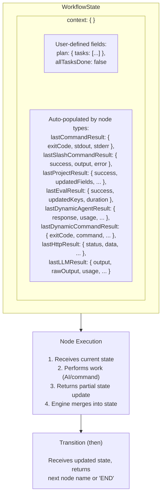

# State Management

The Graph Engine maintains a single state object that flows through the workflow.

## WorkflowState Structure

```typescript
import { WorkflowStatus } from '@sys/graph';

interface WorkflowState<TContext> {
  currentNode: string;           // Active FSM node
  status: WorkflowStatus;        // Workflow execution status (enum)
  updatedAt: string;             // ISO timestamp
  conversationHistory: Message[];// AI conversation history
  context: TContext;             // User-defined data
}

// WorkflowStatus enum values:
enum WorkflowStatus {
  Pending = 'pending',     // Workflow created but not started
  Running = 'running',     // Workflow is currently executing
  Completed = 'completed', // Workflow completed successfully
  Failed = 'failed',       // Workflow failed with an error
  Paused = 'paused',       // Workflow was paused and can be resumed
}
```

## Data Flow

State flows through nodes as a single object:



## Reading State

Access data from previous nodes via `state.context`:

```typescript
then: (state) => {
  // Read plan created by PLAN node
  const plan = state.context.plan;

  // Read result from previous command
  const result = state.context.lastCommandResult;

  // Make routing decision
  if (result?.exitCode === 0) {
    return 'SUCCESS';
  }
  return 'FAILURE';
}
```

## Writing State

### Via Node Results

Each node type automatically stores its result:

| Node Type | Result Key | Contains |
|-----------|------------|----------|
| `AgentNode` | *conversation history* | Agent response stored in `conversationHistory` |
| `CommandNode` | `lastCommandResult` | `exitCode`, `stdout`, `stderr`, `success`, `duration` |
| `SlashCommandNode` | `lastSlashCommandResult` | `success`, `output`, `error`, `duration`, `filesAffected` |
| `GitHubProjectNode` | `lastProjectResult` | `success`, `updatedFields`, `issueNumber`, `repository` |
| `EvalNode` | `lastEvalResult` | `success`, `updatedKeys`, `duration` |
| `DynamicAgentNode` | `lastDynamicAgentResult` | `success`, `response`, `model`, `usage`, `duration` |
| `DynamicCommandNode` | `lastDynamicCommandResult` | `exitCode`, `stdout`, `stderr`, `success`, `command`, `duration` |
| `HttpNode` | `lastHttpResult` | `success`, `status`, `statusText`, `headers`, `data`, `duration` |
| `LLMNode` | `lastLLMResult` | `success`, `output`, `rawOutput`, `model`, `usage`, `duration` |
| `GitCheckoutNode` | `checkout` | `workDir`, `owner`, `repo`, `ref`, `sha` |
| `FetchIssuesNode` | `fetchedIssues` | Array of fetched GitHub issues |
| `BuildDagNode` | `dagResult` | `readyIssues`, `blockedIssues`, `matrix` |
| `SetStatusNode` | `statusUpdateResult` | `success`, `updatedIssues`, `errors` |

### Via Custom Tools

AgentNodes can update context through tool results:

```typescript
capabilities: [{
  name: 'save_plan',
  schema: z.object({ tasks: z.array(z.string()) }),
  execute: async (args) => {
    // Tool result is available to the agent
    return { saved: true, taskCount: args.tasks.length };
  },
}]
```

## Custom Context Types

Define strongly-typed context:

```typescript
import { defineNodes, defineWorkflow, StdlibTool } from '@sys/graph';

interface MyContext extends Record<string, unknown> {
  plan?: { tasks: string[] };
  currentTask?: string;
  completedTasks: string[];
  testResults?: TestResult[];
  allTasksDone: boolean;

  // Auto-populated by nodes
  lastCommandResult?: CommandResult;
  lastSlashCommandResult?: SlashCommandResult;
  lastEvalResult?: EvalResult;
}

const schema = defineNodes<MyContext>()([
  'PLAN',
  'IMPLEMENT',
  'TEST',
] as const);

export default defineWorkflow({
  id: 'my-workflow',
  schema,
  initialContext: {
    completedTasks: [],
    allTasksDone: false,
  },

  nodes: [
    schema.agent('PLAN', {
      role: 'planner',
      prompt: 'Create a plan for the task.',
      capabilities: [StdlibTool.Read],
      then: 'IMPLEMENT',
    }),
    // ... more nodes
  ],
});
```

## Persistence

State is automatically saved after each node execution.

### Storage Location

```
.graph-state/
└── {workflow-id}.json    # Workflow state
```

### Resume from Checkpoint

The engine automatically resumes from the last successful node:

```typescript
// First run - starts from first node
const result1 = await engine.run('my-workflow', { context: { ... } });

// If interrupted, next run resumes from checkpoint
const result2 = await engine.run('my-workflow');
```

### Manual Reset

Clear state to start fresh:

```typescript
engine.reset('my-workflow');
```

### State File Format

```json
{
  "currentNode": "IMPLEMENT",
  "status": "running",
  "updatedAt": "2024-01-15T10:30:00Z",
  "conversationHistory": [...],
  "context": {
    "plan": { "tasks": ["task1", "task2"] },
    "completedTasks": ["task1"],
    "lastCommandResult": {
      "exitCode": 0,
      "stdout": "Build successful",
      "stderr": "",
      "success": true,
      "duration": 1234
    }
  }
}
```

## Best Practices

### 1. Define Complete Context Types

```typescript
// Good: explicit types for all expected fields
interface MyContext extends Record<string, unknown> {
  input: string;
  result?: ProcessResult;
  error?: string;
}

// Avoid: loose typing
interface MyContext {
  [key: string]: unknown;
}
```

### 2. Initialize Required Fields

```typescript
defineWorkflow({
  id: 'my-workflow',
  schema,
  initialContext: {
    completedTasks: [],  // Initialize arrays
    retryCount: 0,       // Initialize counters
  },
  // ...
});
```

### 3. Use Descriptive Result Keys

```typescript
// Good: specific key names
schema.command('BUILD', {
  command: 'bun build',
  resultKey: 'buildResult',  // Clear what this contains
  then: 'TEST',
}),

// Avoid: generic keys
schema.command('BUILD', {
  command: 'bun build',
  resultKey: 'result',  // Ambiguous
  then: 'TEST',
}),
```

### 4. Handle Missing State

```typescript
then: (state) => {
  // Guard against missing data
  const result = state.context.lastCommandResult;
  if (!result) {
    return 'ERROR';
  }
  return result.success ? 'SUCCESS' : 'FAILURE';
}
```
