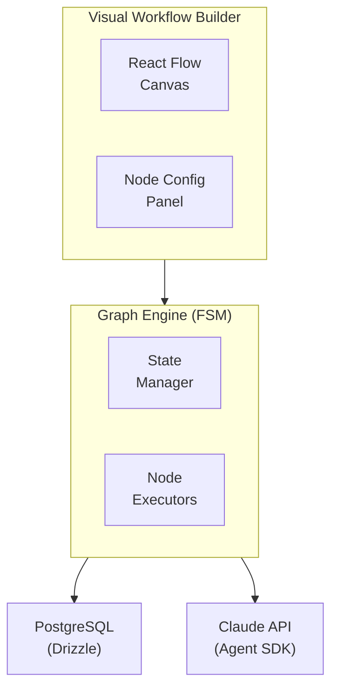

# Foundry

**Visual workflow builder for AI-powered software development pipelines**

Build, visualize, and execute multi-step AI workflows with a drag-and-drop interface. Foundry combines a React Flow-based visual editor with a powerful FSM execution engine to orchestrate Claude-powered automation pipelines.

---

## Key Features

### 🎨 Visual Workflow Builder

Drag-and-drop workflow construction with React Flow. Connect nodes visually, configure them in real-time, and see your automation pipeline come to life.

### ⚡ FSM-Based Execution

Deterministic state machine execution with checkpoint/resume capability. Pause workflows, inspect state, and resume from any node.

### 🤖 AI-Powered Nodes

Integrate Claude Agent SDK directly into your workflows. Agent nodes can use tools, execute multi-turn conversations, and make intelligent decisions.

### 🔄 Real-Time Visualization

Watch your workflows execute in real-time with animated node states, live logs, and execution progress tracking via Server-Sent Events.

### 📊 Rich Node Library

Pre-built nodes for common operations:
- **Agent** - Claude-powered AI execution with tool access
- **Command** - Shell command execution
- **Slash Command** - Claude Code operations (/commit, /test, etc.)
- **HTTP** - REST API calls
- **LLM** - Direct Claude API calls with structured output
- **Eval** - JavaScript context transformation
- **GitHub Project** - GitHub Projects V2 status updates
- **Git Checkout** - Clone GitHub repositories for workflow execution

### 🔗 GitHub Integration

Dispatch workflows via GitHub Actions, update GitHub Projects, and automate your development pipeline.

### 🔌 MCP Server Support

Connect Agent nodes to Model Context Protocol servers for extended capabilities. Pre-built presets for Playwright (browser automation), Figma (design integration), and Sequential Thinking (reasoning).

### 🐳 Docker Execution

Execute workflows in isolated Docker containers via Railway for improved security, reproducibility, and scalability. Configure custom images per workflow with encrypted environment variables.

---

## Quick Start

### Installation

```bash
# Clone the repository
git clone https://github.com/iota-uz/foundry.git
cd foundry

# Install dependencies
bun install

# Set up database
docker compose up -d postgres
bun db:push

# Set up environment variables
cp .env.example .env.local
# Edit .env.local and add your Anthropic API key and DATABASE_URL
```

### Development

```bash
# Start development server
bun dev

# Visit http://localhost:3000
```

### Your First Workflow

1. **Launch Foundry** - Run `bun dev` and open your browser
2. **Create Workflow** - Click "New Workflow" on the home page
3. **Add Nodes** - Drag nodes from the left sidebar onto the canvas
4. **Connect Nodes** - Draw edges between nodes to define flow
5. **Configure Nodes** - Click nodes to configure in the right panel
6. **Execute** - Click "Run" to start workflow execution
7. **Monitor** - Watch real-time progress in the Execution panel

---

## Architecture Overview



---

## Technology Stack

| Layer              | Technology                    |
| ------------------ | ----------------------------- |
| **Runtime**        | Bun                           |
| **Framework**      | Next.js 14+ (App Router)      |
| **UI Library**     | React 18+                     |
| **Styling**        | Tailwind CSS v4 + Headless UI |
| **State**          | Zustand                       |
| **Diagrams**       | React Flow                    |
| **AI**             | Claude Agent SDK (Anthropic)  |
| **Database**       | PostgreSQL + Drizzle ORM      |
| **Real-time**      | Server-Sent Events (SSE)      |

---

## Documentation

### Core Concepts

- [Graph Engine](./graph/) - FSM-based workflow execution
- [Architecture](./graph/architecture) - Core design concepts
- [Node Types](./graph/nodes) - Built-in node catalog
- [Primitives](./graph/primitives) - Low-level building blocks
- [State Management](./graph/state) - Checkpoint and resume
- [Transitions](./graph/transitions) - Routing between nodes

### Visual Builder

- [Workflow Builder](./workflow-builder/) - Visual workflow construction
- [MCP Servers](./workflow-builder/mcp-servers) - Model Context Protocol integration
- [Docker Execution](./workflow-builder/docker-execution) - Container-based execution

### Integration

- [GitHub Dispatch](./dispatch) - Trigger workflows via GitHub Actions
- [GitHub Projects](./github-projects) - Status updates and automation

### Reference

- [API Reference](./graph/api) - Type-safe workflow API
- [Custom Nodes](./graph/custom-nodes) - Creating your own nodes
- [Examples](./graph/examples) - Full workflow examples

---

## Use Cases

### 🔄 CI/CD Automation

Orchestrate complex deployment pipelines with AI-powered decision making. Run tests, analyze results, and decide next steps automatically.

### 🐛 Intelligent Bug Fixing

Create workflows that analyze failing tests, generate fixes with Claude, and verify the solution before committing.

### 📝 Code Review Pipelines

Build automated code review workflows that analyze PRs, check for patterns, and provide structured feedback.

### 🚀 Feature Development

Define multi-step feature implementation workflows: plan → implement → test → fix → commit.

---

## Node Types at a Glance

| Node | Purpose | AI-Powered |
|------|---------|------------|
| Agent | Multi-turn AI execution with tools | ✅ |
| Command | Shell command execution | ❌ |
| SlashCommand | Claude Code operations | ✅ |
| HTTP | REST API calls | ❌ |
| LLM | Direct Claude API calls | ✅ |
| Eval | JavaScript transformation | ❌ |
| GitHubProject | Project status updates | ❌ |
| GitCheckout | Clone GitHub repository | ❌ |
| DynamicAgent | Runtime AI configuration | ✅ |
| DynamicCommand | Runtime command configuration | ❌ |

---

## Contributing

Foundry is open source. Contributions are welcome!

See the [GitHub repository](https://github.com/iota-uz/foundry) for more information.

---

## License

MIT License - see LICENSE file for details

---

## Links

- [GitHub Repository](https://github.com/iota-uz/foundry)
- [Issues & Bug Reports](https://github.com/iota-uz/foundry/issues)
- [Graph Engine Docs](./graph/)

---

**Ready to build AI-powered workflows?** [Get Started →](./graph/)
