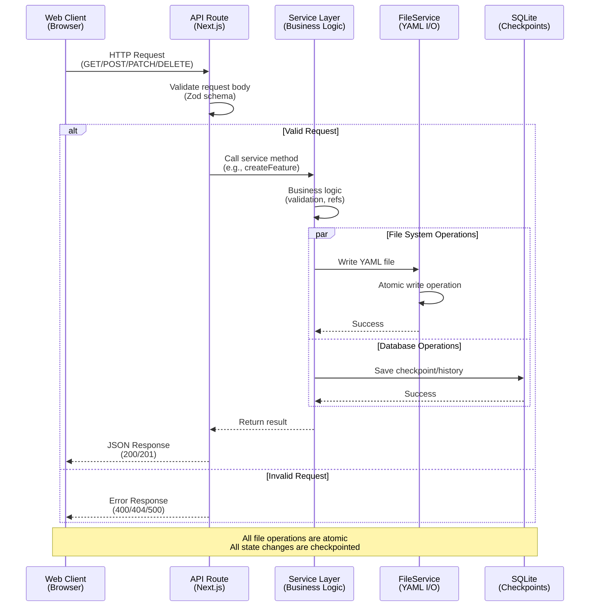

# API Schema

**Status:** Draft

## Overview

This document defines the internal REST API contracts for Foundry. All routes are served by the Next.js application on the same origin (localhost:3000 by default).

### API Request Flow Architecture



## REST Endpoints

### Projects

#### List Projects

```
GET /api/projects
Response:
  {
    "projects": [
      {
        "id": "project-123",
        "name": "My SaaS App",
        "description": "User management platform",
        "createdAt": "2025-01-15T10:00:00Z",
        "updatedAt": "2025-01-15T10:00:00Z",
        "path": "/path/to/project"
      }
    ]
  }
```

#### Get Project

```
GET /api/projects/:id
Response:
  {
    "project": {
      "id": "project-123",
      "name": "My SaaS App",
      "description": "User management platform",
      "createdAt": "2025-01-15T10:00:00Z",
      "updatedAt": "2025-01-15T10:00:00Z",
      "path": "/path/to/project",
      "modules": [
        { "id": "mod-1", "name": "Authentication", "slug": "auth" }
      ]
    }
  }
```

#### Create Project

```
POST /api/projects
Body:
  {
    "name": "My SaaS App",
    "description": "User management platform",
    "path": "/path/to/project"
  }
Response:
  {
    "project": { /* project object */ }
  }
Status: 201
```

### Modules

#### List Modules

```
GET /api/projects/:projectId/modules
Response:
  {
    "modules": [
      {
        "id": "mod-1",
        "projectId": "project-123",
        "name": "Authentication",
        "slug": "auth",
        "features": [ /* feature array */ ]
      }
    ]
  }
```

#### Create Module

```
POST /api/projects/:projectId/modules
Body:
  {
    "name": "Authentication",
    "slug": "auth"
  }
Response: { "module": { /* module object */ } }
Status: 201
```

### Features

#### List Features

```
GET /api/modules/:moduleId/features
Response:
  {
    "features": [
      {
        "id": "feat-1",
        "name": "User Login",
        "slug": "user-login",
        "status": "complete",
        "phase": "cto_complete"
      }
    ]
  }
```

#### Get Feature Details

```
GET /api/features/:id
Response:
  {
    "feature": {
      "id": "feat-1",
      "name": "User Login",
      "slug": "user-login",
      "status": "complete",
      "phase": "cto_complete",
      "businessRequirements": { /* requirements */ },
      "technicalArtifacts": { /* artifacts */ },
      "implementationPlan": { /* tasks */ },
      "dependencies": [ "feat-2", "feat-3" ]
    }
  }
```

#### Create Feature

```
POST /api/modules/:moduleId/features
Body:
  {
    "name": "User Login",
    "description": "Allow users to authenticate"
  }
Response: { "feature": { /* feature object */ } }
Status: 201
```

### Workflows

#### Start Workflow

```
POST /api/workflows/start
Body:
  {
    "type": "cpo" | "clarify" | "cto" | "reverse_engineer",
    "projectId": "project-123",
    "featureId": "feat-1" | null,
    "context": { /* workflow context */ }
  }
Response:
  {
    "sessionId": "session-abc123",
    "workflowType": "cpo",
    "currentStep": 1
  }
Status: 201
```

#### Pause Workflow

```
POST /api/workflows/:sessionId/pause
Response:
  {
    "sessionId": "session-abc123",
    "status": "paused",
    "currentStep": 5
  }
```

#### Resume Workflow

```
POST /api/workflows/:sessionId/resume
Response:
  {
    "sessionId": "session-abc123",
    "status": "resuming",
    "currentStep": 5
  }
```

#### Get Workflow State

```
GET /api/workflows/:sessionId
Response:
  {
    "sessionId": "session-abc123",
    "type": "cpo",
    "status": "in_progress" | "paused" | "complete" | "failed",
    "currentStep": 5,
    "totalSteps": 20,
    "context": { /* workflow state */ }
  }
```

#### Retry Failed Step

```
POST /api/workflows/:sessionId/retry/:stepId
Response:
  {
    "sessionId": "session-abc123",
    "currentStep": 5,
    "result": { /* step result */ }
  }
```

#### Submit Answer to Question

```
POST /api/workflows/:sessionId/answer
Body:
  {
    "questionId": "q-123",
    "answer": "selected_option" | ["option1", "option2"],
    "customAnswer": "free text answer" | null
  }
Response:
  {
    "acknowledged": true,
    "nextQuestion": { /* next question or completion */ }
  }
```

### Workflow Stream (SSE)

```
GET /api/workflows/:sessionId/stream

Response (Server-Sent Events):
  event: question
  data: {"questionId": "q-1", "text": "...", "type": "single_choice", ...}

  event: batch
  data: {"batchId": "b-1", "topic": "Authentication", "questions": [...]}

  event: spec_update
  data: {"artifact": "schema", "changes": {...}}

  event: step_complete
  data: {"stepId": "s-5", "result": {...}}

  event: workflow_complete
  data: {"sessionId": "session-123"}
```

### Constitution

#### Get Constitution

```
GET /api/constitution
Response:
  {
    "constitution": { /* full constitution object */ }
  }
Status: 404 if not defined
```

#### Create/Update Constitution

```
POST /api/constitution
Body:
  {
    "principles": [ "..." ],
    "coding": { /* coding standards */ },
    "security": { /* security rules */ },
    "ux": { /* UX patterns */ },
    "constraints": { /* tech constraints */ },
    "hooks": { /* hook definitions */ }
  }
Response:
  {
    "constitution": { /* updated constitution */ }
  }
Status: 201 or 200
```

### Analysis

#### Run Analyzer

```
POST /api/analyze/run
Body:
  {
    "scope": "full" | "schema" | "apis" | "components"
  }
Response:
  {
    "analysisId": "analysis-123",
    "issues": [
      {
        "severity": "error" | "warning" | "info",
        "type": "missing_reference" | "schema_violation" | ...,
        "message": "...",
        "location": "schemas/schema.dbml:45",
        "suggestion": "..."
      }
    ],
    "summary": {
      "errors": 2,
      "warnings": 5,
      "info": 12
    }
  }
```

### Git Operations

#### Get Git Status

```
GET /api/git/status
Response:
  {
    "branch": "main",
    "status": "clean" | "modified",
    "files": [
      { "path": ".foundry/features/user-login.yaml", "status": "M" },
      { "path": ".foundry/schemas/schema.dbml", "status": "M" }
    ],
    "ahead": 0,
    "behind": 2
  }
```

#### Commit Changes

```
POST /api/git/commit
Body:
  {
    "message": "Add user login feature",
    "files": [ ".foundry/features/user-login.yaml" ]
  }
Response:
  {
    "hash": "abc123def456",
    "message": "Add user login feature",
    "author": "user@example.com"
  }
Status: 201
```

#### Create Branch

```
POST /api/git/branch
Body:
  {
    "name": "feature/payments",
    "from": "main"
  }
Response:
  {
    "name": "feature/payments",
    "createdAt": "2025-01-15T10:00:00Z"
  }
Status: 201
```

#### Push/Pull

```
POST /api/git/pull
Response: { "status": "success", "pulled": 3 }

POST /api/git/push
Response: { "status": "success", "pushed": 2 }
```

### Error Responses

#### Common Error Format

```json
{
  "error": "Feature not found",
  "code": "FEATURE_NOT_FOUND",
  "details": {
    "featureId": "feat-123"
  }
}
```

#### HTTP Status Codes

- 200 OK - Successful GET/POST/PATCH
- 201 Created - Resource created
- 204 No Content - Successful DELETE
- 400 Bad Request - Invalid input
- 404 Not Found - Resource not found
- 409 Conflict - Git conflict or state conflict
- 500 Internal Server Error - Unexpected error

## WebSocket Alternatives

**Note:** Not implemented in v1.0. Using Server-Sent Events (SSE) for workflow streaming instead.

For future enhancements, WebSocket could be used for:

- Real-time bidirectional communication
- Live collaboration (multi-user scenarios)
- Low-latency question updates

See [decisions.md](decisions.md) D3 for decision rationale.
