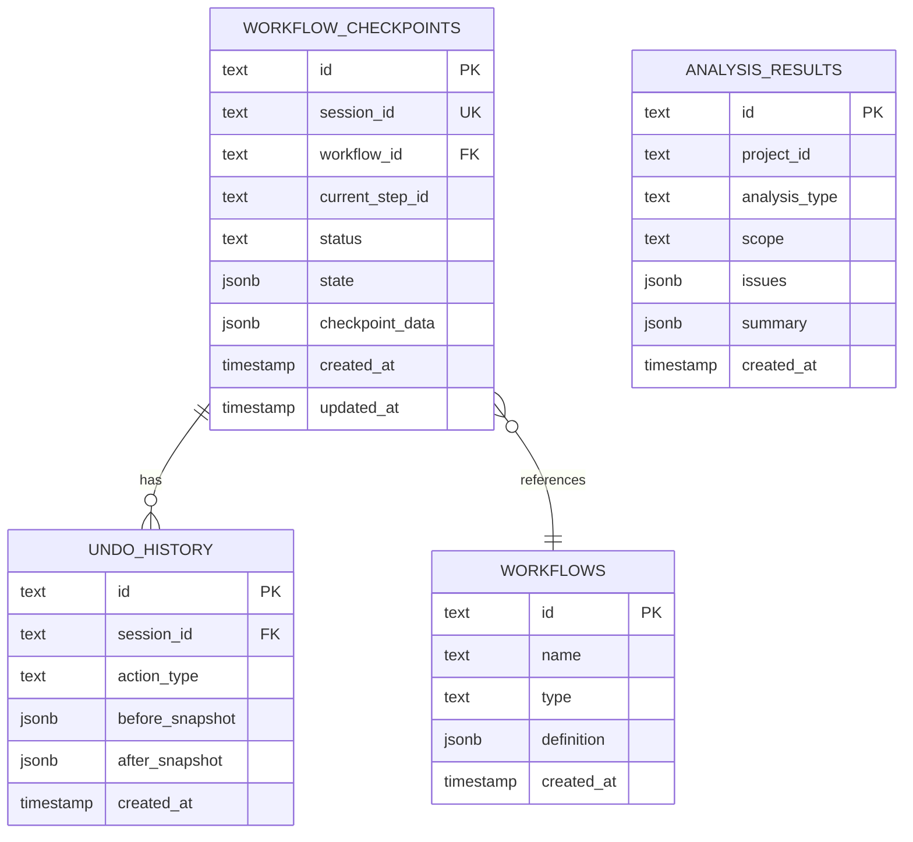

# Data Model

**Status:** Draft

## Overview

Foundry uses a hybrid storage approach:

- **File System:** Project structure, specs, artifacts (Git-trackable)
- **SQLite:** Workflow checkpoints, undo stack, analysis results (local only)

## Design Decisions

| Decision       | Choice         | Rationale                                              |
| -------------- | -------------- | ------------------------------------------------------ |
| File Format    | YAML           | Human-readable, good Git diffs, familiar to developers |
| ID Format      | Slug-based     | Human-readable (e.g., `user-login`, `checkout`)        |
| ID Scope       | Per-module     | Same slug allowed in different modules                 |
| ID Conflicts   | Block + prompt | User chooses unique name                               |
| Relationships  | Bidirectional  | Both sides store refs for navigation                   |
| Schema Version | Global         | Single version in project.yaml                         |

## File System Structure

### Directory Tree Visualization

```
project-root/
├── .foundry/
│   ├── foundry.db              # SQLite database
│   ├── project.yaml            # Project metadata + global schema version
│   ├── constitution.yaml       # Optional: Governing principles (F6)
│   ├── lessons-learned.md      # AI-maintained feedback loop (F11)
│   ├── prompts/                # Handlebars prompt templates
│   │   ├── cpo-generate-question-system.hbs
│   │   ├── cpo-generate-question-user.hbs
│   │   ├── cto-generate-question-system.hbs
│   │   ├── cto-generate-question-user.hbs
│   │   ├── schema-generator-system.hbs
│   │   ├── schema-generator-user.hbs
│   │   └── ... (all other prompt files)
│   ├── modules/
│   │   ├── auth/
│   │   │   ├── module.yaml     # Module metadata
│   │   │   └── features/
│   │   │       ├── login.yaml  # Includes tasks + checklist
│   │   │       └── register.yaml
│   │   └── payments/
│   │       ├── module.yaml
│   │       └── features/
│   │           └── checkout.yaml
│   ├── schemas/
│   │   └── schema.dbml         # Unified DBML schema
│   ├── apis/
│   │   ├── openapi.yaml        # OpenAPI spec
│   │   └── schema.graphql      # GraphQL schema
│   └── components/
│       ├── pages/
│       │   ├── login.html
│       │   └── dashboard.html
│       └── shared/
│           ├── button.html
│           └── modal.html
├── src/                        # Existing codebase (for RE mode)
└── ...
```

**Key Changes from Original:**

- Features organized under their module directories (scoped IDs)
- Slug-based IDs (directory/file names are the IDs)
- Bidirectional references between artifacts

## File Schemas

### project.yaml

```yaml
id: 'proj_abc123'
name: 'My SaaS App'
description: 'A project management tool for remote teams'
mode: 'new' # new | reverse_engineered
phase: 'cto' # cpo | clarify | cto | complete
version: '1'
settings:
  defaultBranch: 'main'
  autoSave: true
  autoCommit: false
createdAt: '2025-01-15T10:00:00Z'
updatedAt: '2025-01-15T14:30:00Z'
```

### Constitution File (constitution.yaml) - Optional (F6)

```yaml
version: '1.0'
createdAt: '2025-01-15T10:00:00Z'
updatedAt: '2025-01-15T14:30:00Z'

# Guiding principles for all AI decisions
principles:
  - 'User data privacy is paramount'
  - 'Fail fast, fail gracefully'
  - 'Accessibility is not optional'

# Coding standards
coding:
  naming:
    functions: 'snake_case'
    classes: 'PascalCase'
    database_tables: 'snake_case_singular'
    database_columns: 'snake_case'
  style:
    max_function_length: 50
    require_docstrings: true
    prefer_composition: true

# Security requirements
security:
  authentication: 'JWT with refresh tokens'
  authorization: 'Role-based access control'
  input_validation: 'Sanitize all user input at API boundary'
  secrets: 'Environment variables only, never hardcode'
  password_hashing: 'bcrypt with cost factor 12'

# UX patterns
ux:
  error_format: 'Include: what went wrong, why, how to fix'
  loading_states: 'Skeleton screens, not spinners'
  accessibility: 'WCAG 2.1 AA compliance'
  responsive: 'Mobile-first design'

# Tech constraints
constraints:
  allowed_libraries:
    - 'axios'
    - 'lodash'
    - 'date-fns'
  forbidden_libraries:
    - 'moment.js'
    - 'jquery'
  node_version: '>=20.0.0'
  typescript: 'strict mode required'

# Agent hooks (F12)
hooks:
  onFeatureSave:
    - action: validateSchema
    - action: updateChecklist
  onSchemaChange:
    - action: regenerateAPIs
      options:
        updateFeatureRefs: true
  preCommit:
    - action: runAnalyzer
      options:
        failOnError: true
        failOnWarning: false
```

### Module File (modules/\*.yaml)

```yaml
id: 'mod_xyz789'
name: 'Authentication'
description: 'User authentication and authorization'
order: 1
features:
  - 'feat_login'
  - 'feat_register'
  - 'feat_password_reset'
createdAt: '2025-01-15T10:30:00Z'
updatedAt: '2025-01-15T12:00:00Z'
```

### Feature File (features/\*.yaml)

```yaml
id: 'feat_login'
moduleId: 'mod_xyz789'
name: 'User Login'
description: 'Allow users to authenticate with email/password'
status: 'completed' # draft | in_progress | completed
phase: 'complete' # cpo | clarify | cto | complete
implemented: false # true for features extracted via reverse engineering
source: 'new' # new | reverse_engineered

# Implementation files - populated for implemented features (reverse engineered)
# Empty array for new features until they are implemented
implementationFiles:
  - path: 'src/auth/login.ts'
    description: 'Login endpoint handler'
  - path: 'src/auth/auth.service.ts'
    description: 'Authentication service with password verification'
  - path: 'src/models/user.ts'
    description: 'User entity definition'

# Business requirements (CPO phase)
business:
  userStory: 'As a user, I want to log in so I can access my account'
  acceptanceCriteria:
    - 'User can enter email and password'
    - 'Invalid credentials show error message'
    - 'Successful login redirects to dashboard'
  priority: 'high'

# Technical details (CTO phase)
technical:
  # References to unified schema entities
  schemaRefs:
    - entity: 'User'
      usage: 'Verify credentials'
    - entity: 'Session'
      usage: 'Create on successful login'

  # References to API endpoints
  apiRefs:
    - type: 'rest'
      method: 'POST'
      path: '/auth/login'
    - type: 'graphql'
      operation: 'mutation login'

  # References to UI components
  componentRefs:
    - id: 'comp_login_page'
      type: 'page'
    - id: 'comp_login_form'
      type: 'component'

# Feature dependencies
dependencies:
  - 'feat_user_management' # Depends on user entity

# Implementation plan
implementationPlan:
  - id: 'step_1'
    order: 1
    title: 'Create Session entity in database'
    description: 'Add sessions table with user_id, token, expires_at'
    complexity: 'low'
  - id: 'step_2'
    order: 2
    title: 'Implement login API endpoint'
    description: 'POST /auth/login - validate credentials, create session'
    complexity: 'medium'
  - id: 'step_3'
    order: 3
    title: 'Build login page UI'
    description: 'Login form with email, password, error states'
    complexity: 'medium'

# Task breakdown (F8) - auto-generated from implementationPlan
tasks:
  - id: 'task_1'
    title: 'Create Session entity in database'
    status: 'completed' # pending | in_progress | completed
    complexity: 'low'
    dependsOn: []
    implementationStepId: 'step_1'
    completedAt: '2025-01-15T14:00:00Z'
  - id: 'task_2'
    title: 'Implement login API endpoint'
    status: 'in_progress'
    complexity: 'medium'
    dependsOn: ['task_1']
    implementationStepId: 'step_2'
  - id: 'task_3'
    title: 'Build login page UI'
    status: 'pending'
    complexity: 'medium'
    dependsOn: ['task_2']
    implementationStepId: 'step_3'

taskProgress:
  total: 3
  completed: 1
  inProgress: 1
  pending: 1
  percentComplete: 33

# Implementation checklist (F10) - auto-generated from acceptanceCriteria
checklist:
  - id: 'check_1'
    criterion: 'User can enter email and password'
    source: 'business.acceptanceCriteria.0'
    verified: true
    verifiedAt: '2025-01-15T15:00:00Z'
    verifiedBy: 'user'
    notes: 'Tested on desktop and mobile'
  - id: 'check_2'
    criterion: 'Invalid credentials show error message'
    source: 'business.acceptanceCriteria.1'
    verified: false
    verifiedAt: null
    verifiedBy: null
    notes: ''

checklistProgress:
  total: 2
  verified: 1
  percentComplete: 50

createdAt: '2025-01-15T11:00:00Z'
updatedAt: '2025-01-15T15:30:00Z'
```

## SQLite Schema

### Entity Relationship Diagram



### Tables

#### workflow_checkpoints

```sql
CREATE TABLE workflow_checkpoints (
  id TEXT PRIMARY KEY,
  session_id TEXT UNIQUE,
  workflow_id TEXT,
  current_step_id TEXT,
  status TEXT,  -- in_progress | paused | complete | failed
  state JSONB,  -- Full workflow state snapshot
  checkpoint_data JSONB,
  created_at TIMESTAMP,
  updated_at TIMESTAMP,
  FOREIGN KEY(workflow_id) REFERENCES workflows(id)
);
```

#### undo_history

```sql
CREATE TABLE undo_history (
  id TEXT PRIMARY KEY,
  session_id TEXT,
  action_type TEXT,  -- feature_created | feature_updated | schema_changed | etc
  before_snapshot JSONB,
  after_snapshot JSONB,
  created_at TIMESTAMP,
  FOREIGN KEY(session_id) REFERENCES workflow_checkpoints(session_id)
);
```

#### analysis_results

```sql
CREATE TABLE analysis_results (
  id TEXT PRIMARY KEY,
  project_id TEXT,
  analysis_type TEXT,
  scope TEXT,  -- full | schema | apis | components
  issues JSONB,
  summary JSONB,
  created_at TIMESTAMP
);
```

### Indexes

```sql
CREATE INDEX idx_workflow_checkpoints_session ON workflow_checkpoints(session_id);
CREATE INDEX idx_workflow_checkpoints_status ON workflow_checkpoints(status);
CREATE INDEX idx_undo_history_session ON undo_history(session_id);
CREATE INDEX idx_analysis_results_project ON analysis_results(project_id);
CREATE INDEX idx_analysis_results_created ON analysis_results(created_at);
```

## Versioning Strategy

See [decisions.md](decisions.md) D22 for detailed versioning approach.

**Summary:**

- All artifact files include `version: "1.0"` field
- Schema version tracked globally in `project.yaml`
- Breaking changes increment major version
- Additive changes increment minor version
- Migration workflow handles major version changes
- Backups stored in `.foundry/.migrations/backup-{timestamp}/`
