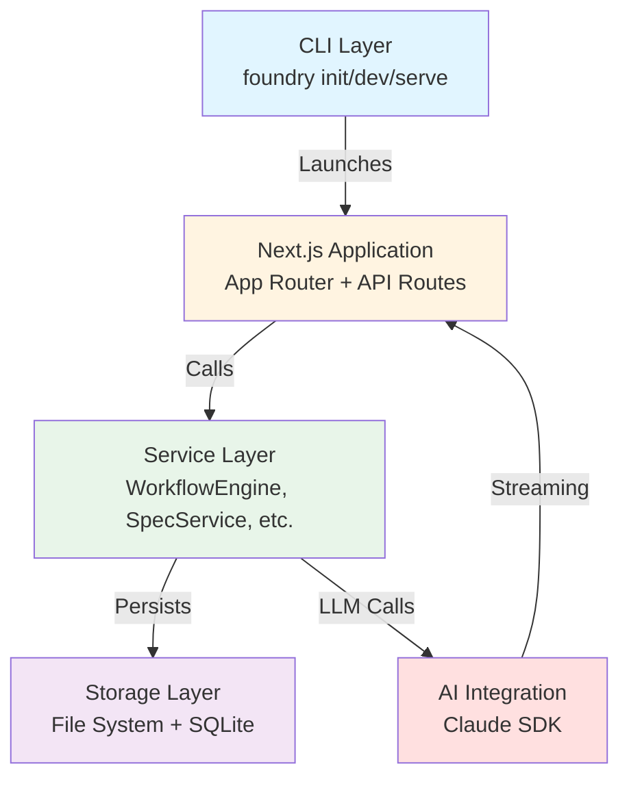
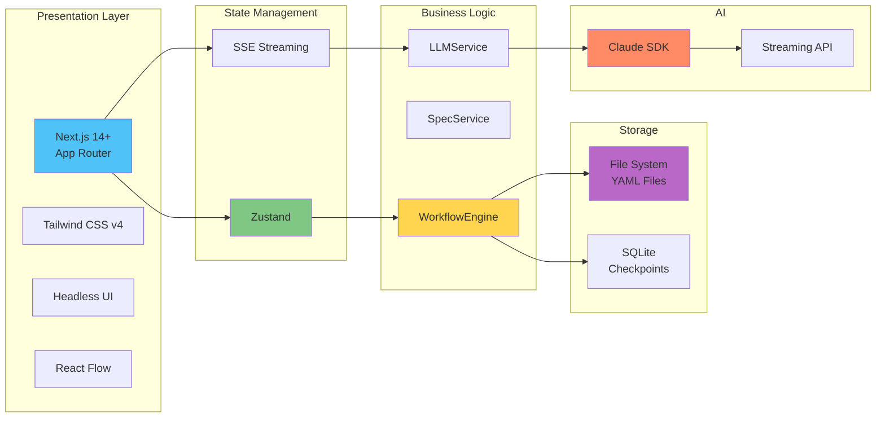

# Technical Architecture

**Status:** Draft

## Technology Stack

| Layer | Technology | Rationale |
|-------|------------|-----------|
| Runtime | Node.js | Required for npm distribution |
| Framework | Next.js 14+ (App Router) | Server components, API routes, file-based routing |
| Styling | Tailwind CSS v4 + Headless UI | Utility-first, accessible components |
| State | Zustand | Single source of truth, simple API |
| AI | Claude Code SDK | Native tool support, streaming |
| Diagrams | React Flow | Unified visualization for all diagram types |
| API Docs | Scalar | Modern API documentation UI |
| Storage | File System + SQLite | Specs as files, history in SQLite |
| Distribution | npm package | `npx foundry` or global install |

## Architecture Overview

### High-Level System Architecture



### Technology Stack Layers



### Detailed Architecture (ASCII)

```
┌─────────────────────────────────────────────────────────────┐
│                         CLI Layer                           │
│  ┌─────────────┐  ┌─────────────┐  ┌─────────────────────┐ │
│  │ foundry init│  │ foundry dev │  │ foundry serve       │ │
│  │ (setup)     │  │ (hot reload)│  │ (production bundle) │ │
│  └─────────────┘  └─────────────┘  └─────────────────────┘ │
└─────────────────────────────────────────────────────────────┘
                              │
                              ▼
┌─────────────────────────────────────────────────────────────┐
│                    Next.js Application                      │
│  ┌────────────────────────────────────────────────────────┐ │
│  │                   App Router                           │ │
│  │  /                    → Dashboard                      │ │
│  │  /spec/new            → New Spec Wizard                │ │
│  │  /spec/reverse        → Reverse Engineer               │ │
│  │  /modules/[id]        → Module View                    │ │
│  │  /features/[id]       → Feature Detail                 │ │
│  │  /visualizations      → Tabbed Diagrams                │ │
│  │  /ui-library          → Component Gallery              │ │
│  └────────────────────────────────────────────────────────┘ │
│  ┌────────────────────────────────────────────────────────┐ │
│  │                   API Routes                           │ │
│  │  /api/projects/*      → Project CRUD                   │ │
│  │  /api/modules/*       → Module CRUD                    │ │
│  │  /api/features/*      → Feature CRUD                   │ │
│  │  /api/artifacts/*     → Schema/API/Component CRUD      │ │
│  │  /api/workflow/start  → Start new workflow             │ │
│  │  /api/workflow/pause  → Pause current workflow         │ │
│  │  /api/workflow/resume → Resume from checkpoint         │ │
│  │  /api/workflow/answer → Submit answer to question      │ │
│  │  /api/workflow/retry  → Retry failed step              │ │
│  │  /api/workflow/stream → SSE endpoint for workflow      │ │
│  │  /api/analyze/*       → Consistency analyzer           │ │
│  │  /api/constitution    → Constitution CRUD              │ │
│  │  /api/lessons/*       → Lessons learned                │ │
│  │  /api/git/*           → Git operations                 │ │
│  └────────────────────────────────────────────────────────┘ │
└─────────────────────────────────────────────────────────────┘
                              │
                              ▼
┌─────────────────────────────────────────────────────────────┐
│                    Service Layer                            │
│  ┌───────────────┐  ┌───────────────┐  ┌────────────────┐  │
│  │ SpecService   │  │WorkflowEngine │  │ GitService     │  │
│  │ - CRUD ops    │  │ - Step exec   │  │ - branch/commit│  │
│  │ - Validation  │  │ - State mgmt  │  │ - push/pull    │  │
│  │ - File sync   │  │ - Checkpoints │  │ - conflict det │  │
│  └───────────────┘  │ - Recovery    │  └────────────────┘  │
│                     └───────────────┘                       │
│  ┌───────────────┐  ┌───────────────┐  ┌────────────────┐  │
│  │QuestionGen    │  │ LLMService    │  │ FileService    │  │
│  │  Service      │  │ - Claude SDK  │  │ - Read/write   │  │
│  │ - Topic ctx   │  │ - Bounded call│  │ - Watch        │  │
│  │ - AI generate │  │ - Structured  │  │                │  │
│  └───────────────┘  └───────────────┘  └────────────────┘  │
│  ┌───────────────┐  ┌───────────────┐  ┌────────────────┐  │
│  │HistoryService │  │ UndoService   │  │ HookService    │  │
│  │ - SQLite ops  │  │ - State stack │  │ - Event listen │  │
│  │ - Search      │  │ - Persistence │  │ - Action exec  │  │
│  └───────────────┘  └───────────────┘  └────────────────┘  │
│  ┌───────────────┐  ┌───────────────┐  ┌────────────────┐  │
│  │AnalyzerService│  │Constitution   │  │ LessonsService │  │
│  │ - Consistency │  │   Service     │  │ - AI feedback  │  │
│  │ - Validation  │  │ - Load/save   │  │ - User entries │  │
│  │ - Reporting   │  │ - Validate    │  │ - Retrieval    │  │
│  └───────────────┘  └───────────────┘  └────────────────┘  │
│  ┌───────────────┐                                          │
│  │ TaskService   │                                          │
│  │ - Task CRUD   │                                          │
│  │ - Progress    │                                          │
│  │ - Checklist   │                                          │
│  └───────────────┘                                          │
└─────────────────────────────────────────────────────────────┘
                              │
                              ▼
┌─────────────────────────────────────────────────────────────┐
│                    Storage Layer                            │
│  ┌─────────────────────────────┐  ┌──────────────────────┐ │
│  │     File System             │  │      SQLite          │ │
│  │  .foundry/                  │  │  .foundry/foundry.db │ │
│  │  ├── project.yaml           │  │  - workflow_checkpoints
│  │  ├── constitution.yaml      │  │  - undo_history      │ │
│  │  ├── lessons-learned.md     │  │  - analysis_results  │ │
│  │  ├── modules/               │  │                      │ │
│  │  ├── features/              │  │                      │ │
│  │  ├── schemas/               │  │                      │ │
│  │  ├── apis/                  │  │                      │ │
│  │  └── components/            │  │                      │ │
│  └─────────────────────────────┘  └──────────────────────┘ │
└─────────────────────────────────────────────────────────────┘
```

## CLI Architecture

### Commands

```bash
# Initialize new project
foundry init

# Start development server (hot reload)
foundry dev [--port 3000]

# Start production server (bundled assets)
foundry serve [--port 3000]

# Open existing project
foundry open [path]
```

### Hybrid Launch Mode

**Development Mode (`foundry dev`):**
- Runs Next.js dev server
- Hot module replacement enabled
- Source maps for debugging
- Slower initial start, fast iteration

**Production Mode (`foundry serve`):**
- Serves pre-built static assets
- Express server for API routes
- Fast startup time
- No hot reload

## AI Integration

**See also:**
- [research/claude-agent-sdk.md](research/claude-agent-sdk.md) - Integration patterns and capabilities
- [research/claude-agent-sdk-apis.md](research/claude-agent-sdk-apis.md) - Complete API reference

### Workflow Architecture

Foundry uses a **workflow-based** architecture instead of agent-based. This provides deterministic execution, bounded LLM calls, and reliable pause/resume capabilities.

```
┌─────────────────────────────────────────────────────────────┐
│              Main Orchestration (Pure Code)                 │
│  - State machine routing                                    │
│  - No LLM orchestration                                     │
│  - Phase transitions based on workflow completion           │
└─────────────────────────────────────────────────────────────┘
           │              │              │              │
           ▼              ▼              ▼              ▼
┌─────────────────┐ ┌──────────────┐ ┌─────────────┐ ┌─────────────┐
│  CPO Workflow   │ │Clarify       │ │CTO Workflow │ │ RE Workflow │
│  (8 topics)     │ │Workflow      │ │ (8 topics)  │ │ (6 steps)   │
│                 │ │              │ │             │ │             │
│ - AI questions  │ │ - Scan(code) │ │ - AI ques.  │ │ - Discover  │
│ - Within topic  │ │ - Categorize │ │ - Auto-gen  │ │ - Analyze   │
│   constraints   │ │   (LLM)      │ │   schemas   │ │ - Extract   │
│ - UpdateSpec    │ │ - Resolve    │ │ - Auto-gen  │ │ - Compile   │
│   after each    │ │   loop       │ │   APIs      │ │             │
└─────────────────┘ └──────────────┘ └─────────────┘ └─────────────┘
                                            │
                                            ▼
                              ┌─────────────────────────┐
                              │   Generator Workflows   │
                              │  ┌──────┐ ┌──────┐     │
                              │  │Schema│ │ API  │     │
                              │  │Gen   │ │Gen   │     │
                              │  └──────┘ └──────┘     │
                              │  ┌──────┐              │
                              │  │Comp. │              │
                              │  │Gen   │              │
                              │  └──────┘              │
                              └─────────────────────────┘
```

**Phase Flow:**
```
CPO Workflow → (auto) → Clarify Workflow → CTO Workflow
                              │
                              ▼
                      [User resolves/defers
                       ambiguities]

CTO Workflow auto-invokes generators after relevant topics:
  - Data Model topic → Schema Generator Workflow
  - API Design topic → API Generator Workflow
  - UI Components topic → Component Generator Workflow
```

### WorkflowEngine Service

The WorkflowEngine is the core service that executes workflow steps:

```typescript
interface WorkflowEngine {
  // Execute a workflow from the beginning or current checkpoint
  execute(workflowId: string, sessionId: string): Promise<WorkflowResult>;

  // Pause at current step
  pause(sessionId: string): Promise<void>;

  // Resume from checkpoint
  resume(sessionId: string): Promise<WorkflowResult>;

  // Get current state
  getState(sessionId: string): Promise<WorkflowState>;

  // Retry failed step
  retryStep(sessionId: string, stepId: string): Promise<WorkflowResult>;
}

// Step execution handlers
interface StepExecutor {
  executeCode(step: CodeStep, ctx: WorkflowContext): Promise<StepResult>;
  executeLLM(step: LLMStep, ctx: WorkflowContext): Promise<StepResult>;
  executeQuestion(step: QuestionStep, ctx: WorkflowContext): Promise<StepResult>;
  executeLoop(step: LoopStep, ctx: WorkflowContext): Promise<StepResult>;
  executeConditional(step: ConditionalStep, ctx: WorkflowContext): Promise<StepResult>;
  executeNestedWorkflow(step: NestedWorkflowStep, ctx: WorkflowContext): Promise<StepResult>;
}
```

**Checkpoint Strategy:**
- Checkpoint saved after each step completion
- On failure: state preserved at failed step
- On resume: re-execute from checkpoint
- Each LLM step has explicit timeout and retry policy

## Error Handling

### AI Failures
- Show error immediately with details
- Provide "Retry" button
- Log to conversation history for debugging
- No auto-retry (user controls retry)

### Git Conflicts
- Detect conflicts before save
- Block save operation
- Display conflict resolution guide
- Link to external merge tool instructions

### Workflow Recovery
- Full workflow state checkpointed to SQLite after each step
- On browser close: state saved automatically at current step
- On reopen: exact state restored, can resume from checkpoint
- Step-level granularity allows retry of individual steps
- Timeout detection: if step exceeds timeout, marked as failed

## Performance Considerations

### Large Codebase Analysis
- Progressive streaming of results
- Incremental UI updates as artifacts discovered
- Cancelable analysis operation
- Memory-efficient file processing

### Visualization Performance
- React Flow virtualization for large diagrams
- Lazy loading of node details
- Debounced layout recalculation
- Canvas-based rendering for 100+ nodes

## Hooks Architecture

### Event System

```
┌─────────────────────────────────────────────────────────────┐
│                    HookService                              │
│  ┌─────────────────────────────────────────────────────────┐│
│  │                  Event Emitter                          ││
│  │  onFeatureSave → [validateSchema, updateChecklist]      ││
│  │  onSchemaChange → [regenerateAPIs]                      ││
│  │  preCommit → [runAnalyzer]                              ││
│  └─────────────────────────────────────────────────────────┘│
└─────────────────────────────────────────────────────────────┘
           │
           ▼
┌─────────────────────────────────────────────────────────────┐
│                    Action Executor                          │
│  ┌───────────────┐  ┌───────────────┐  ┌────────────────┐  │
│  │validateSchema │  │updateChecklist│  │ regenerateAPIs │  │
│  │ - DBML parse  │  │ - Criteria    │  │ - OpenAPI sync │  │
│  │ - Ref check   │  │ - Auto-verify │  │ - GraphQL sync │  │
│  └───────────────┘  └───────────────┘  └────────────────┘  │
│  ┌───────────────┐                                          │
│  │  runAnalyzer  │                                          │
│  │ - Full check  │                                          │
│  │ - Block/warn  │                                          │
│  └───────────────┘                                          │
└─────────────────────────────────────────────────────────────┘
```

### Hook Configuration (constitution.yaml)

```yaml
hooks:
  onFeatureSave:
    - action: validateSchema
    - action: updateChecklist
  onSchemaChange:
    - action: regenerateAPIs
      options:
        updateFeatureRefs: true
  preCommit:
    - action: runAnalyzer
      options:
        failOnError: true
        failOnWarning: false
```

### Hook Execution Flow

1. **Event Triggered** - User action or AI operation
2. **Load Configuration** - Read hooks from constitution.yaml
3. **Execute Actions** - Run each action in sequence
4. **Handle Failures** - Based on `failOnError` setting:
   - If true: Block operation, show error
   - If false: Log warning, continue
5. **Report Results** - Show hook execution status in UI

### Available Hook Events

| Event | Triggered When |
|-------|----------------|
| `onFeatureSave` | Feature file saved (manual or AI) |
| `onSchemaChange` | DBML schema modified |
| `onAPIChange` | OpenAPI or GraphQL spec modified |
| `onComponentChange` | UI component HTML modified |
| `preCommit` | Before git commit operation |

### Available Hook Actions

| Action | Description |
|--------|-------------|
| `validateSchema` | Validate DBML syntax and references |
| `updateChecklist` | Sync checklist with acceptance criteria |
| `regenerateAPIs` | Update API specs from schema changes |
| `runAnalyzer` | Run full consistency analyzer |
| `notifyUser` | Show toast notification |
