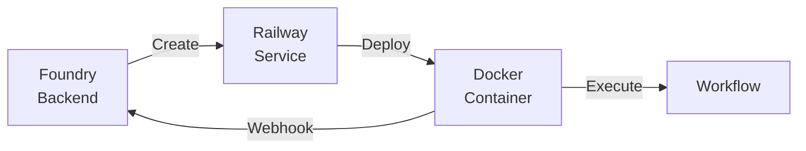

# Docker Execution

Foundry supports executing workflows in isolated Docker containers for improved security, reproducibility, and scalability.

## Overview

Instead of running workflows in the Foundry server process, you can execute them in dedicated containers. This provides:

- **Isolation** - Workflows run in separate environments
- **Reproducibility** - Consistent execution environment
- **Scalability** - Parallel execution across containers
- **Security** - Sandboxed execution with limited access

## Architecture



1. Foundry creates a container service via Railway
2. The container runs the workflow runner
3. Progress updates are sent back via webhooks
4. Results are stored in the database

## Workflow Runner Image

The base workflow runner image provides a minimal environment for executing workflows.

### Base Image

```dockerfile
FROM oven/bun:1.1-alpine
```

### Pre-installed Tools

| Tool | Purpose |
|------|---------|
| git | Repository cloning |
| curl | HTTP requests |
| jq | JSON processing |
| bash | Shell scripts |
| openssh-client | SSH operations |
| ca-certificates | HTTPS support |

### Security

- Non-root user: `foundry` (UID 1001)
- Read-only filesystem (except `/tmp` and `/workspace`)
- No privileged access

## Configuration

### Per-Workflow Docker Image

Each workflow can specify a custom Docker image:

1. In the visual builder, open workflow settings
2. Enter the Docker image in the "Docker Image" field
3. Use the format: `registry/image:tag`

Default image: `foundry/workflow-runner:latest`

### Custom Images

Extend the base image to add custom tools:

```dockerfile
FROM foundry/workflow-runner:latest

# Add Python
RUN apk add --no-cache python3 py3-pip

# Add custom scripts
COPY scripts/ /app/scripts/

# Add configuration
COPY .env.example /app/.env
```

Build and push to your registry:

```bash
docker build -t myregistry/my-runner:latest .
docker push myregistry/my-runner:latest
```

Then reference it in your workflow configuration.

## Environment Variables

The container receives these environment variables at runtime:

| Variable | Description |
|----------|-------------|
| `FOUNDRY_API_URL` | Base URL of the Foundry API |
| `FOUNDRY_EXECUTION_ID` | UUID of the execution to run |
| `FOUNDRY_API_TOKEN` | JWT token for authentication |
| `FOUNDRY_WORKING_DIR` | Working directory (default: `/workspace`) |

### Workflow Secrets

Encrypted workflow secrets are injected as environment variables. Configure them in the workflow settings under "Environment Variables".

## Railway Integration

Foundry uses Railway for container orchestration.

### How It Works

1. **Service Creation** - Foundry creates a Railway service for the workflow
2. **Deployment** - The Docker image is deployed to Railway
3. **Execution** - The container runs and executes the workflow
4. **Cleanup** - The service is destroyed after completion

### Tracking

Execution records include:

| Field | Description |
|-------|-------------|
| `railwayServiceId` | Railway service identifier |
| `railwayDeploymentId` | Deployment identifier |
| `retryCount` | Number of retry attempts |

### Retry Behavior

If a container fails:

1. Foundry checks the failure reason
2. Transient failures trigger automatic retry (up to 3 attempts)
3. Permanent failures mark the execution as failed
4. Retry count is tracked in the execution record

## Webhook Communication

Containers communicate with Foundry via webhooks:

### Progress Updates

```json
{
  "type": "node_started",
  "executionId": "uuid",
  "nodeId": "IMPLEMENT",
  "timestamp": "2024-01-15T10:30:00Z"
}
```

### Completion

```json
{
  "type": "workflow_completed",
  "executionId": "uuid",
  "context": { ... },
  "timestamp": "2024-01-15T10:35:00Z"
}
```

### Failure

```json
{
  "type": "workflow_failed",
  "executionId": "uuid",
  "error": "Error message",
  "nodeId": "IMPLEMENT",
  "timestamp": "2024-01-15T10:35:00Z"
}
```

## Best Practices

### Image Size

Keep images small for faster deployment:

- Use Alpine-based images
- Multi-stage builds for compilation
- Remove build dependencies after installation

### Secrets Management

- Never bake secrets into images
- Use workflow secrets for sensitive values
- Rotate tokens regularly

### Debugging

View container logs via Railway dashboard or CLI:

```bash
railway logs --service <service-id>
```

### Resource Limits

Configure resource limits in Railway:

- Memory: 512MB default, increase for memory-intensive workflows
- CPU: Shared by default, dedicated for compute-heavy tasks

## Limitations

| Limitation | Description |
|------------|-------------|
| **No GPU** | GPU workloads not currently supported |
| **Ephemeral** | Container state is not persisted between executions |
| **Network** | Outbound only, no inbound connections |
| **Timeout** | Maximum execution time: 1 hour |
