# Visual Workflow Builder

A React Flow-based visual interface for constructing and executing AI-powered workflows.

## Overview

The Workflow Builder provides a drag-and-drop canvas for creating Graph Engine workflows visually. Instead of writing code, you can:

- Drag nodes from the sidebar onto the canvas
- Connect nodes with edges to define flow
- Configure nodes via the right panel
- Execute workflows and monitor progress in real-time

## Components

The visual builder consists of several key components:

| Component | Purpose |
|-----------|---------|
| [Workflow Canvas](canvas) | React Flow canvas for node placement and connection |
| [Node Library](node-library) | Sidebar with draggable node types |
| [Node Config Panel](config-panel) | Right panel for configuring selected nodes |
| [Execution Panel](execution) | Real-time execution status and controls |
| [Execution History](history) | List of past workflow executions |

## Architecture

```mermaid
flowchart TB
    subgraph WE["Workflow Editor"]
        NLS["Node<br/>Library<br/>Sidebar"]
        RFC["React Flow<br/>Canvas"]
        CEP["Config/<br/>Execution<br/>Panel"]
    end

    subgraph ZS["Zustand Stores"]
        WB["workflow-builder<br/>(nodes, edges)"]
        WEX["workflow-execution<br/>(status, logs)"]
    end

    SC["Schema Converter<br/>React Flow → GraphEngine WorkflowConfig"]
    GE["GraphEngine (FSM)<br/>Executes workflow with checkpoint/resume"]

    WE --> ZS
    ZS --> SC
    SC --> GE
```



## Quick Start

### Creating a Workflow

1. Navigate to the home page (`/`)
2. Click "New Workflow"
3. Drag nodes from the left sidebar onto the canvas
4. Connect nodes by dragging from output handles to input handles
5. Click nodes to configure them in the right panel
6. Set workflow name and description in the toolbar
7. Click "Save" to persist the workflow

### Executing a Workflow

1. Open a saved workflow
2. Click "Run" in the toolbar
3. Switch to the "Execution" tab in the right panel
4. Watch real-time progress:
   - Node states update as execution progresses
   - Logs stream in real-time via SSE
   - Current node is highlighted on the canvas
5. Use pause/resume/cancel controls as needed

## Node Types

The builder supports all Graph Engine node types:

| Node | Icon | Description | AI-Powered |
|------|------|-------------|------------|
| Agent | 🤖 | Multi-turn Claude execution with tools | ✅ |
| Command | ⌨️ | Shell command execution | ❌ |
| Slash Command | ⚡ | Claude Code operations | ✅ |
| HTTP | 🌐 | REST API calls | ❌ |
| LLM | 💬 | Direct Claude API calls | ✅ |
| Eval | 📝 | JavaScript transformation | ❌ |
| Dynamic Agent | 🔄 | Runtime AI configuration | ✅ |
| Dynamic Command | 🔧 | Runtime command configuration | ❌ |
| GitHub Project | 📊 | Project status updates | ❌ |
| Git Checkout | 📦 | Clone GitHub repository | ❌ |

## New Features

### MCP Servers

Agent nodes can connect to Model Context Protocol servers for extended capabilities. See [MCP Servers](mcp-servers) for configuration.

**Presets available:**
- Playwright (browser automation)
- Figma (design integration)
- Sequential Thinking (reasoning)

### Docker Execution

Workflows can run in isolated Docker containers for improved security and reproducibility. See [Docker Execution](docker-execution) for setup.

### Encrypted Environment Variables

Store sensitive configuration securely:

1. Open workflow settings
2. Navigate to "Environment Variables"
3. Add key-value pairs
4. Values are encrypted with AES-256-GCM
5. Secrets are injected at runtime

Secrets are never exposed in API responses or logs.

## State Management

The builder uses two Zustand stores:

### workflow-builder.store

Manages visual editor state:

```typescript
interface WorkflowBuilderState {
  nodes: Node<WorkflowNodeData>[];     // React Flow nodes
  edges: Edge[];                        // React Flow edges
  selectedNodeId: string | null;        // Currently selected node
  metadata: WorkflowMetadata;           // Name, description, context
  isDirty: boolean;                     // Unsaved changes
  isLoading: boolean;                   // Loading state
  error: string | null;                 // Error message
}
```

### workflow-execution.store

Manages execution state:

```typescript
interface WorkflowExecutionState {
  executionId: string | null;
  status: WorkflowStatus;
  currentNodeId: string | null;
  nodeStates: Record<string, NodeExecutionState>;
  logs: LogEntry[];
}
```

## API Endpoints

### Workflow CRUD

| Method | Endpoint | Description |
|--------|----------|-------------|
| GET | `/api/workflows` | List all workflows |
| POST | `/api/workflows` | Create workflow |
| GET | `/api/workflows/:id` | Get workflow by ID |
| PUT | `/api/workflows/:id` | Update workflow |
| DELETE | `/api/workflows/:id` | Delete workflow |
| POST | `/api/workflows/:id/execute` | Start execution |

### Execution Control

| Method | Endpoint | Description |
|--------|----------|-------------|
| GET | `/api/workflows/executions/:id` | Get execution state |
| GET | `/api/workflows/executions/:id/stream` | SSE event stream |
| POST | `/api/workflows/executions/:id/pause` | Pause execution |
| POST | `/api/workflows/executions/:id/resume` | Resume execution |
| POST | `/api/workflows/executions/:id/cancel` | Cancel execution |

## Schema Converter

The builder uses a schema converter to translate between:

- **React Flow format**: Visual nodes with positions, edges with handles
- **GraphEngine format**: Workflow configuration with transition functions

### React Flow → GraphEngine

```typescript
import { toWorkflowConfig } from '@/lib/workflow-builder/schema-converter';

const result = toWorkflowConfig(nodes, edges, {
  id: 'my-workflow',
  name: 'My Workflow',
  initialContext: { key: 'value' }
});

if (result.success) {
  const config = result.workflow.config;
  // Execute with GraphEngine
}
```

### GraphEngine → React Flow

```typescript
import { fromWorkflowConfig } from '@/lib/workflow-builder/schema-converter';

const { nodes, edges } = fromWorkflowConfig(workflowConfig);
// Load into React Flow canvas
```

## Real-Time Updates

Execution updates are streamed via Server-Sent Events (SSE):

```typescript
const eventSource = new EventSource(`/api/workflows/executions/${id}/stream`);

eventSource.onmessage = (event) => {
  const data = JSON.parse(event.data);

  switch (data.type) {
    case 'connected':
      // Initial state
      break;
    case 'node_started':
      // Node execution started
      break;
    case 'node_completed':
      // Node execution completed
      break;
    case 'workflow_completed':
      // Workflow finished
      break;
    case 'workflow_failed':
      // Workflow errored
      break;
  }
};
```

## File Structure

```
src/components/workflow-builder/
├── index.ts                    # Exports
├── workflow-canvas.tsx         # React Flow canvas
├── node-library-sidebar.tsx    # Draggable node types
├── node-config-panel.tsx       # Node configuration forms
├── execution-panel.tsx         # Real-time execution display
├── execution-history.tsx       # Past executions list
├── workflow-toolbar.tsx        # Save, run, validate
├── nodes/
│   └── base-workflow-node.tsx  # Base node component
└── edges/
    └── workflow-edge.tsx       # Animated edge component

src/lib/workflow-builder/
├── index.ts                    # Exports
├── schema-converter.ts         # React Flow ↔ GraphEngine
├── validation.ts               # Client-side validation
└── execution-events.ts         # SSE subscription management

src/store/
├── workflow-builder.store.ts   # Visual builder state
└── workflow-execution.store.ts # Execution state
```

## Database Schema

Workflows and executions are stored in PostgreSQL:

```sql
-- Workflows table
CREATE TABLE workflows (
  id UUID PRIMARY KEY DEFAULT gen_random_uuid(),
  name TEXT NOT NULL,
  description TEXT,
  nodes JSONB NOT NULL,           -- React Flow nodes
  edges JSONB NOT NULL,           -- React Flow edges
  initial_context JSONB,
  docker_image TEXT,              -- Custom Docker image for execution
  created_at TIMESTAMP DEFAULT NOW(),
  updated_at TIMESTAMP DEFAULT NOW()
);

-- Executions table
CREATE TABLE workflow_executions (
  id UUID PRIMARY KEY DEFAULT gen_random_uuid(),
  workflow_id UUID REFERENCES workflows(id) NOT NULL,
  status TEXT NOT NULL,           -- pending|running|paused|completed|failed
  current_node TEXT NOT NULL,
  context JSONB NOT NULL,
  node_states JSONB DEFAULT '{}',
  conversation_history JSONB DEFAULT '[]',
  last_error TEXT,
  railway_service_id TEXT,        -- Container orchestration
  railway_deployment_id TEXT,     -- Deployment tracking
  retry_count INTEGER DEFAULT 0,  -- Retry attempts
  started_at TIMESTAMP DEFAULT NOW(),
  completed_at TIMESTAMP,
  updated_at TIMESTAMP DEFAULT NOW()
);

-- Workflow secrets table (encrypted environment variables)
CREATE TABLE workflow_secrets (
  id UUID PRIMARY KEY DEFAULT gen_random_uuid(),
  workflow_id UUID REFERENCES workflows(id) ON DELETE CASCADE NOT NULL,
  key TEXT NOT NULL,              -- Variable name (uppercase)
  encrypted_value TEXT NOT NULL,  -- AES-256-GCM encrypted
  created_at TIMESTAMP DEFAULT NOW(),
  updated_at TIMESTAMP DEFAULT NOW(),
  UNIQUE(workflow_id, key)
);
```
